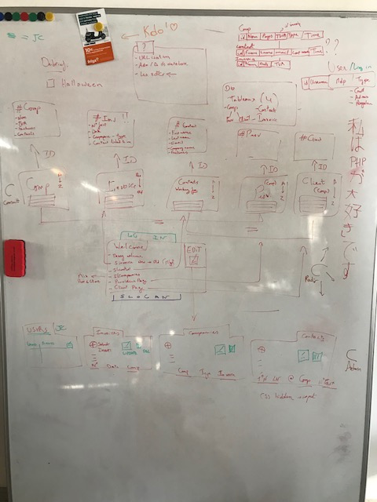

# Cogip
Repo pour le projet COGIP dans le cadre des cours de BeCode.org, déployé sur [TBA].
Le projet doit être réalisé en 9 jours.

## Logbook

### Première journée

- Organisation du projet: comprendre le briefing, les features demandées. 

- Dessiner le modèle de la banque de données

- Penser l'organisation de la structure MVC 

### Deuxième journée
- La base de donnée est mise au point par Nicolas
- Pendant la journée il apparaît que la structure MVC pensée au préalable n'est pas correcte. Nicolas et Jeason se penchent sur l'organisation en MVC et le router.
- La base de donnée est importée sur Heroku par Octavia
- Octavia crée les mockups et des images sur mesures pour le front-end

### Troisième journée
- Les requêtes SQL pour les consultations de la banque de données sont créées par Nicolas.
- Jeason mets au point le router
- Octavia commence le front-end

### Quatrième journée
- Jeason travaille sur le front end pour la view home/welcome
- Octavia debugge certains aspects du login et continue à travailler sur le router
- Nicolas est absent

### Cinquième journée
*Lors de cette journée la décision est prise de ne pas insister sur les query et view pour la consultation, mais de bifurquer vers le module d'édition, qui nous permettra de nous familiariser avec le CRUD.*

- Nicolas continue sur les query et les models
- Des conflits au niveau des variables globales, du router / controllers et des fonctions sont gérés par Octavia
- Jeason continue le travail sur le front end et l'affichage des query
