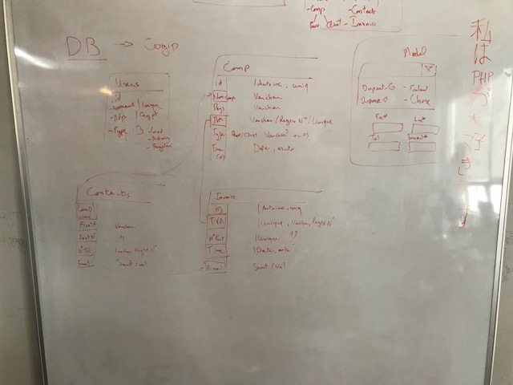

# Cogip
Repo pour le projet COGIP dans le cadre des cours de BeCode.org, déployé sur [TBA].
Le projet doit être réalisé en 9 jours.

# Logbook

### Première journée

- Organisation du projet: comprendre le briefing, les features demandées. 

- Dessiner le modèle de la banque de données

- Penser l'organisation de la structure MVC 

### Deuxième journée
- La base de donnée est mise au point par Nicolas
- Pendant la journée il apparaît que la structure MVC pensée au préalable n'est pas correcte. Nicolas et Jeason se penchent sur l'organisation en MVC et le router.
- La base de donnée est importée sur Heroku par Octavia
- Octavia crée les mockups, un arrière-plan, un logo et le slogan.

### Troisième journée
- Les premières requêtes SQL pour les consultations de la banque de données sont créées par Nicolas.
- Jeason commence le router
- Octavia crée le front-end du login.

### Quatrième journée
- Jeason travaille sur le front end pour la view home/welcome et la barre de navigation.
- Octavia debugge le log in
- Nicolas est absent

### Cinquième journée
*Lors de cette journée la décision est prise de ne pas insister sur les query et view pour la consultation, mais de bifurquer vers le module d'édition.*

- Nicolas continue sur les query et les models, uniquement des query de consultation
- Des conflits au niveau des variables globales, de la redirection, de l'affichage CSS et des fonctions sont gérés par Octavia
- Jeason continue le travail sur le front end et l'affichage des query

### Sixième journée

- Continuation du front par Jeason
- Mise au point des views home et reprenant les query sur toutes les compagnies / factures par Jeason
- Lien entre eux des views et controllers, routers etc par Octavia

### Septième journée

- Les requêtes SQL sont intégrées dans les views par Jeason et Nicolas.
- Certaines fonctions sont repensées en fonction de la nouvelle architecture.
- Des nouvelles façon de faire les vues sont implémentées, menant à une restructuration de l'architecture et du router.

### Huitième journée 
*Lors de cette journée la décision a été prise de changer les rôles. Par exemple Jeason formule les query SQL pour les insertions dans la banque de données, Nicolas passe sur le front. Ce choix est fait en connaissance de cause: le groupe s'en trouvera ralentit et dans le cadre d'un projet client nous ne le ferions sans doute pas. Cependant le but étant d'apprendre, nous préférons rendre le projet sans doute non terminé, mais ayant chacun travaillé sur tous les aspects.*

- Octavia remanie le routeur en fonction de la nouvelles structure, établit le passage de toutes les compagnies à une seule
- Octavia écrit les requêtes SQL pour la récupération d'un seule facture, compagnie ou d'un contact
- Nicolas crée le front du module d'édition et débugge certains soucis CSS
- Nicolas crée une fonction de logout et modifie la barre de navigation
- Jeason écrit les requêtes SQL pour l'insertion et l'update

### Neuvième journée

- Octavia déploie le site sur Heroku dès la matinée, afin de s'assurer que en fin de journée le déployement sera fait facilement.

